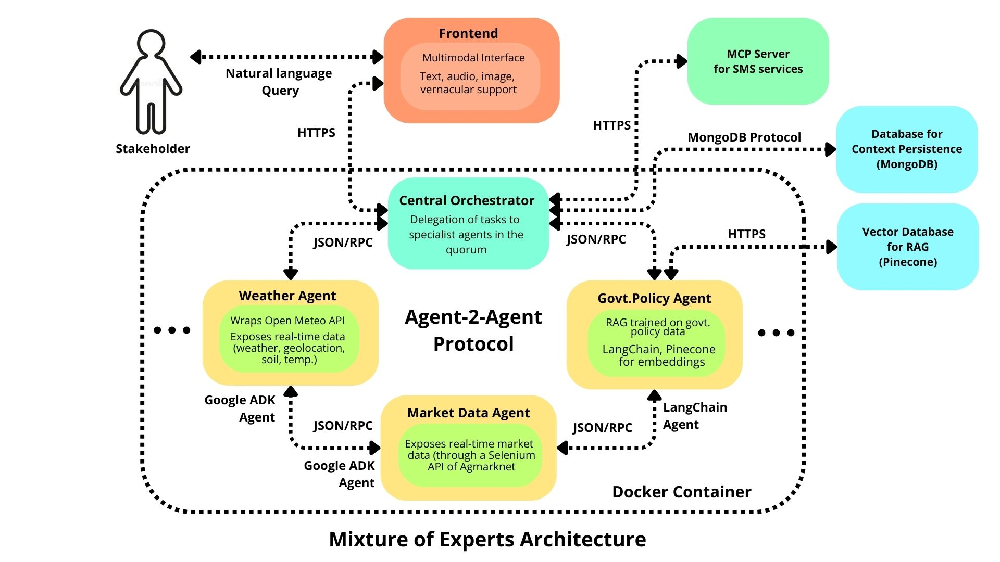

# 🌾 BHUMI AI - Agricultural Intelligence Orchestration Platform

> **A sophisticated multi-agent agricultural intelligence system providing hyperlocalized farming insights for Indian agriculture through orchestration and communication between specialized domain expert agents.**

## **Project Overview**

BHUMI AI is a agricultural intelligence platform built on Google's Agent Development Kit (ADK) and Agent-2-Agent (A2A) Protocol that orchestrates specialized AI agents to deliver comprehensive farming insights. The system combines real-time market data, weather intelligence, government schemes, and agricultural expertise through an intelligent routing architecture.

### **Core Mission**
Democratize access to precision agricultural intelligence for Indian farmers through AI-powered multi-agent coordination, enabling data-driven farming decisions at hyperlocal levels.

---
## **Deployed Link**
[https://bhumi-ai.com](https://bhumi-ai-bv2l.vercel.app/)

## **System Architecture**

### **Intelligent Agent Orchestration**
The platform employs a **routing-first architecture** with an intelligent orchestrator that coordinates specialized agents based on query analysis and agent capability matching.



### **Technology Stack**

#### **Core Framework**
- **Google Agent Development Kit (ADK)**: Primary agent framework for building, deploying, and managing AI agents
- **Agent-to-Agent (A2A) Orchestration**: Google's A2A framework for seamless multi-agent coordination and communication
- **Gemini AI Models**: Advanced language models for natural language processing and multimodal capabilities
- **FastAPI**: High-performance API framework for agent communication
- **Python 3.12+**: Modern Python for robust development

#### **Data & Storage**
- **MongoDB**: Conversation persistence and context management
- **Pinecone**: Vector database for advanced RAG (Retrieval-Augmented Generation)
- **CEDA Agmarknet API**: Real-time agricultural market data
- **Open-Meteo API**: Comprehensive weather and soil data

#### **Orchestration & Communication**
- **Agent-to-Agent (A2A) Framework**: Google's native A2A orchestration for seamless multi-agent workflows
- **HTTP/REST APIs**: Inter-agent communication protocol
- **Agent Cards**: Standardized capability and skill definitions
- **Remote Agent Manager**: Connection pooling and health monitoring
- **Conversation Context**: Persistent dialogue and personalization

---

## **Specialized Agents**

### **1. Agricultural Orchestrator** *(Port 10007)*
**Role**: Intelligent routing coordinator and multimodal interface

**Capabilities**:
- **Multimodal Input Processing**: Images, text, and voice through Gemini 2.0 Flash
- **Smart Agent Routing**: Skill-based agent selection and query delegation
- **Agent Discovery**: Real-time capability assessment and availability monitoring
- **Fallback Intelligence**: Personal knowledge as backup when routing isn't feasible

**Key Features**:
- Agent card-based intelligent routing
- Comprehensive agent capability discovery
- Multimodal agricultural query processing
- Context-aware conversation management

---

### **2. Market Intelligence Agent** *(Port 10006)*
**Role**: Comprehensive agricultural market intelligence specialist

**7 Core Skills**:
1. **Commodity Price Intelligence**: 453+ commodities across Indian markets
2. **Market Discovery Intelligence**: Geographic market resolution and discovery
3. **Supply Chain Analysis**: Arrival quantities and supply condition monitoring
4. **Comparative Market Analysis**: Multi-dimensional price and trend comparison
5. **Intelligent Commodity Resolution**: Multilingual search with fuzzy matching
6. **Contextual Market Intelligence**: Conversation memory and personalized insights
7. **Atomic API Orchestration**: Dynamic CEDA API workflow coordination

**Technical Arsenal**: 26+ specialized tools including tier-1 workflows, market discovery, supply analysis, and atomic data tools.

---

### **3. Weather Intelligence Agent** *(Port 10005)*
**Role**: Agricultural weather intelligence and precision farming advisor

**7 Core Skills**:
1. **Comprehensive Farm Conditions Analysis**: Complete agricultural dashboard
2. **Advanced Spraying Analysis & Timing**: Pesticide application optimization
3. **Optimal Planting Window Analysis**: Crop-specific timing recommendations
4. **Precision Irrigation Scheduling**: Water management optimization
5. **Crop Disease Risk Assessment**: Weather-based disease prevention
6. **Agricultural Weather Forecasts**: 1-16 day farming-focused forecasts
7. **Historical Weather Analysis**: Trend analysis and agricultural planning

**Technical Arsenal**: 11 specialized tools for weather data, soil analysis, forecasting, and agricultural optimization.

---

### **4. Schemes Intelligence Agent** *(Port 10004)*
**Role**: Government schemes and agricultural policy specialist

**7 Core Skills**:
1. **Advanced Agricultural Scheme Discovery**: 453+ scheme documents and programs
2. **Comprehensive Eligibility Analysis**: Step-by-step application guidance
3. **Context-Aware Scheme Intelligence**: MongoDB-persisted personalized recommendations
4. **Advanced Subsidy & Benefits Analysis**: Financial impact assessment
5. **Specialized Farmer Support**: Category-specific assistance (women, tribal, small/marginal)
6. **Real-Time Scheme Updates**: Latest launches and policy changes
7. **Advanced RAG Orchestration**: Sophisticated Pinecone vector search and synthesis

**Technical Foundation**: RAG-powered responses with Pinecone vector database and MongoDB conversation persistence.

---

## **Agent Communication Protocol**

### **A2A (Agent-to-Agent) Orchestration**
The platform leverages Google's **Agent-to-Agent (A2A) framework** for sophisticated multi-agent coordination, enabling seamless communication, task delegation, and collaborative intelligence across specialized agents.

### **Inter-Agent Messaging**
```python
# Agent-to-Agent Communication Flow via A2A Framework
orchestrator -> agent_discovery() -> capability_matching()
orchestrator -> a2a_send_message(agent_name, query) 
specialized_agent -> a2a_process_query() -> return_response()
orchestrator -> synthesize_response() -> user_delivery()
```

### **A2A Framework Benefits**
- **Seamless Integration**: Native ADK integration for agent-to-agent communication
- **Intelligent Routing**: Built-in query routing and agent selection capabilities
- **Context Preservation**: Automatic conversation context sharing across agents
- **Error Handling**: Robust failure recovery and graceful degradation
- **Performance Optimization**: Efficient message passing and resource management
---

## 🛠️ **Technical Implementation**

### **Agent Development Kit (ADK) Integration**
- **Agent Definition**: YAML-based agent configuration with skill declarations
- **Tool Integration**: Seamless tool binding and execution
- **Conversation Management**: Built-in context persistence and memory
- **Model Integration**: Direct Gemini model integration with advanced capabilities

### **Routing Intelligence**
- **Skill Matching**: Query analysis against agent skill sets
- **Capability Assessment**: Real-time agent capability evaluation
- **Load Balancing**: Intelligent query distribution across agents
- **Context Preservation**: Conversation continuity across agent interactions

### **Data Integration**
- **Real-Time APIs**: Live integration with government and weather data sources
- **Vector Search**: Advanced semantic search through Pinecone
- **Conversation Persistence**: MongoDB-backed dialogue history
- **Caching Strategy**: Optimized data retrieval and response times

---

## **Key Features**

### **Intelligent Query Processing**
- **Multimodal Support**: Process text, images, and voice inputs
- **Contextual Understanding**: Maintain conversation context across interactions
- **Skill-Based Routing**: Automatically route queries to appropriate specialists
- **Comprehensive Responses**: Synthesize insights from multiple data sources

### **Data-Driven Insights**
- **Real-Time Market Data**: Live commodity prices and market conditions
- **Precision Weather Intelligence**: Hyperlocal weather and soil conditions
- **Government Scheme Intelligence**: Comprehensive policy and subsidy information
- **Historical Analysis**: Trend analysis and predictive insights

### **Seamless Integration**
- **RESTful APIs**: Standard HTTP/REST interfaces for all agents
- **Scalable Architecture**: Microservices-based design for horizontal scaling
- **Modular Design**: Independent agent deployment and updates
- **Robust Communication**: Reliable inter-agent messaging and coordination

---

## **Getting Started**

### **Prerequisites**
- Python 3.12+
- Google ADK Framework
- MongoDB instance
- Pinecone account
- API keys for 

### **Quick Start**
```bash
# Start all agents in separate terminals
cd schemes_rag_agent && python __main__.py      # Port 10004
cd weather_agent_adk && python __main__.py      # Port 10005  
cd market_agent_adk && python __main__.py       # Port 10006
cd agricultural_orchestrator && python __main__.py  # Port 10007
```

### **Agent Endpoints**
- **Orchestrator**: `http://localhost:10007` - Main entry point
- **Market Agent**: `http://localhost:10006` - Market intelligence
- **Weather Agent**: `http://localhost:10005` - Weather intelligence  
- **Schemes Agent**: `http://localhost:10004` - Government schemes

---

## **Innovation Highlights**

### **Advanced AI Orchestration**
- **Dynamic Agent Discovery**: Real-time capability assessment and routing
- **Skill-Based Intelligence**: Query matching against detailed agent capabilities
- **Multimodal Processing**: Image, text, and voice input handling
- **Context-Aware Routing**: Intelligent agent selection based on conversation history

### **Precision Agriculture Focus**
- **Hyperlocal Intelligence**: City and district-level agricultural insights
- **Multi-Source Integration**: Market, weather, and policy data synthesis
- **Farmer-Centric Design**: Tools and insights tailored for Indian agricultural practices
- **Real-Time Decision Support**: Live data for immediate farming decisions

### **Technical Excellence**
- **Microservices Architecture**: Scalable, maintainable, and resilient system design
- **Advanced RAG Implementation**: Sophisticated document retrieval and synthesis
- **Robust Error Handling**: Comprehensive failure recovery and user feedback
- **Performance Optimization**: Efficient data processing and response generation

---

## **Roadmap & Future Enhancements**

- ** Regional Expansion**: Support for additional regional languages and crops
- ** Mobile Integration**: Native mobile applications for field use
- ** Advanced AI Models**: Integration of newer Gemini models and capabilities
- ** Analytics Dashboard**: Comprehensive farming analytics and insights
- ** IoT Integration**: Sensor data integration for precision agriculture
- ** Educational Modules**: Training and educational content for farmers

---

## **License & Contact**

**Project**: BHUMI AI Agricultural Intelligence Platform  
**Framework**: Google Agent Development Kit (ADK)  
**Architecture**: Multi-Agent Intelligent Orchestration  
**Focus**: Indian Agricultural Intelligence & Precision Farming

*Built with ❤️ for Indian farmers using open-source AI technology.* 
